# AKAS - Danışman Atama Modülü ER Diyagramı

Bu diyagram, Danışman Atama işlemlerinde kullanılan temel tabloları ve ilişkileri göstermektedir.

## ER Diyagramı

## Mermaid Diagram

```mermaid
erDiagram
    %% ========== CORE ENTITIES (Danışman Atama Modülü İçin Kritik) ==========
    
    ogrenci ||--o{ danisman_gecmisi : "has history"
    akademik_personel ||--o{ danisman_gecmisi : "advises"
    akademik_personel ||--o{ ogrenci : "current advisor"
    program_turleri ||--o{ ogrenci : "enrolled in"
    durum_turleri ||--o{ ogrenci : "has status"
    anabilim_dallari ||--o{ akademik_personel : "belongs to"
    enstituler ||--o{ anabilim_dallari : "contains"
    anabilim_dallari ||--o{ program_turleri : "offers"
    
    %% ========== STUDENT RELATIONS ==========
    
    ogrenci ||--o| ogrenci_akademik_durum : "has academic status"
    ogrenci ||--o{ ogrenci_asamalari : "progresses through"
    ogrenci ||--o{ ogrenci_dersleri : "enrolls in"
    ogrenci ||--o{ ogrenci_durum_gecmisi : "status history"
    ogrenci ||--o| ogrenci_risk_skorlari : "has risk score"
    ogrenci ||--o{ akademik_gorevler : "receives tasks"
    ogrenci ||--o{ tezler : "writes thesis"
    ogrenci ||--o{ tik_toplantilari : "attends meetings"
    ogrenci ||--o{ yeterlik_sinavlari : "takes exams"
    
    %% ========== ACADEMIC STAFF RELATIONS ==========
    
    akademik_personel ||--o{ akademik_personel_uzmanlik : "has expertise"
    akademik_personel ||--o{ acilan_dersler : "teaches"
    akademik_personel ||--o{ akademik_gorevler : "assigns tasks"
    akademik_personel ||--o{ tezler : "supervises"
    akademik_personel ||--o{ tez_juri_uyelikleri : "jury member"
    akademik_personel ||--o{ ogrenci_durum_gecmisi : "changes student status"
    
    %% ========== COURSE RELATIONS ==========
    
    dersler ||--o{ acilan_dersler : "offered as"
    dersler ||--o{ program_turleri : "belongs to program"
    acilan_dersler ||--o{ ogrenci_dersleri : "student enrollment"
    akademik_takvim ||--o{ acilan_dersler : "scheduled in"
    
    %% ========== THESIS RELATIONS ==========
    
    tezler ||--o{ tez_onerileri : "proposal"
    tezler ||--o{ tez_savunmalari : "defense"
    tezler ||--o{ tez_donem_kayitlari : "progress records"
    tezler ||--o{ akademik_gorevler : "related tasks"
    tez_savunmalari ||--o{ tez_juri_uyelikleri : "jury members"
    
    %% ========== PROGRAM & STAGE RELATIONS ==========
    
    program_turleri ||--o{ asama_tanimlari : "defines stages"
    asama_tanimlari ||--o{ ogrenci_asamalari : "student stages"
    ogrenci_asamalari ||--o| ogrenci_akademik_durum : "current stage"
    
    %% ========== RISK & HISTORY ==========
    
    ogrenci ||--o{ risk_tarihcesi : "risk history"
    akademik_takvim ||--o{ risk_tarihcesi : "calculated in period"
    
    %% ========== AUTH & ADMIN ==========
    
    adminler ||--o{ ogrenci_durum_gecmisi : "admin changes"
    
    %% ========== TABLE DEFINITIONS ==========
    
    ogrenci {
        uuid ogrenci_id PK
        uuid program_turu_id FK
        uuid durum_id FK
        uuid danisman_id FK "⭐ Mevcut Danışman"
        text ad
        text soyad
        text ogrenci_no
        date kayit_tarihi
        numeric gno
        boolean aktif_mi
    }
    
    akademik_personel {
        uuid personel_id PK
        uuid anabilim_dali_id FK
        text unvan
        text ad
        text soyad
        text email
        integer mevcut_danismanlik_sayisi "⭐ İŞ KURALI 1"
        integer tezli_kotasi "⭐ İŞ KURALI 1"
        integer tezsiz_kotasi "⭐ İŞ KURALI 1"
        boolean aktif_danisman_mi "⭐ İŞ KURALI 2"
        boolean aktif_mi "⭐ İŞ KURALI 2"
        text rol
    }
    
    danisman_gecmisi {
        uuid gecmis_id PK
        uuid ogrenci_id FK
        uuid danisman_id FK
        date atama_tarihi
        date ayrilma_tarihi
        boolean aktif_mi "⭐ Aktif Atama"
        text degisiklik_nedeni
    }
    
    program_turleri {
        uuid program_turu_id PK
        uuid anabilim_dali_id FK
        text program_adi
        text program_kodu
        integer maksimum_sure_yil
        integer maksimum_sure_yariyil
        integer normal_sure_yariyil
    }
    
    durum_turleri {
        uuid durum_id PK
        text durum_adi
        text durum_kodu
        integer sira_no
    }
    
    anabilim_dallari {
        uuid anabilim_dali_id PK
        uuid enstitu_id FK
        text anabilim_dali_adi
        text anabilim_dali_kodu
        text bolum_kodu
    }
    
    enstituler {
        uuid enstitu_id PK
        text enstitu_adi
        text enstitu_kodu
        text universite_adi
    }
    
    ogrenci_akademik_durum {
        uuid ogrenci_id PK "FK"
        uuid mevcut_asama_id FK
        integer mevcut_yariyil
        boolean ders_tamamlandi_mi
        integer tamamlanan_ders_sayisi
        numeric not_ortalamasi
        integer tamamlanan_akts
    }
    
    ogrenci_asamalari {
        uuid asama_id PK
        uuid ogrenci_id FK
        uuid asama_tanimi_id FK
        date baslangic_tarihi
        date bitis_tarihi
        text durum
        integer gecikme_yariyil
    }
    
    asama_tanimlari {
        uuid asama_tanimi_id PK
        uuid program_turu_id FK
        text asama_kodu
        text asama_adi
        integer sira_no
        integer azami_sure_yariyil
    }
    
    ogrenci_dersleri {
        uuid ders_kayit_id PK
        uuid ogrenci_id FK
        uuid acilan_ders_id FK
        text ders_kodu
        text ders_adi
        integer yariyil
        integer akademik_yil
        text not_kodu
        integer tekrar_sayisi
        integer akts
        text donem_tipi
        boolean basarili_mi
    }
    
    dersler {
        uuid ders_id PK
        uuid program_turu_id FK
        text ders_kodu "UK"
        text ders_adi
        text ders_turu
        integer akts
        boolean kritik_darbogaz_mi
    }
    
    acilan_dersler {
        uuid acilan_ders_id PK
        uuid ders_id FK
        uuid akademik_donem_id FK
        uuid ogretim_uyesi_id FK
        integer kontenjan
        text donem_tipi
        text ders_programi_saati
    }
    
    akademik_takvim {
        uuid takvim_id PK
        text akademik_yil_adi "UK"
        date guz_ders_baslangic
        date guz_ders_bitis
        date bahar_ders_baslangic
        date bahar_ders_bitis
        boolean aktif_mi
    }
    
    ogrenci_risk_skorlari {
        uuid risk_id PK
        uuid ogrenci_id FK "UK"
        integer risk_skoru
        text risk_seviyesi
        jsonb risk_faktorleri
        date tahmini_mezuniyet_tarihi
        numeric azami_sureye_yakinlik_yuzdesi
    }
    
    risk_tarihcesi {
        uuid id PK
        uuid ogrenci_id FK
        uuid akademik_yil_id FK
        integer risk_skoru
        text risk_seviyesi
        jsonb ana_faktorler
        text donem_tipi
    }
    
    tezler {
        uuid tez_id PK
        uuid ogrenci_id FK
        uuid danisman_id FK
        text baslik
        text konu_ozeti
        text durum
        date baslangic_tarihi
        date bitis_tarihi
    }
    
    tez_onerileri {
        uuid oneri_id PK
        uuid ogrenci_id FK
        uuid tez_id FK
        date oneri_tarihi
        text sonuc
        text tez_konusu
    }
    
    tez_savunmalari {
        uuid savunma_id PK
        uuid ogrenci_id FK
        uuid tez_id FK
        date savunma_tarihi
        text sonuc
        text nihai_sonuc
    }
    
    tez_juri_uyelikleri {
        uuid id PK
        uuid savunma_id FK
        uuid personel_id FK
        text dis_juri_ad_soyad
        text rol
        boolean katildi_mi
    }
    
    tik_toplantilari {
        uuid toplanti_id PK
        uuid ogrenci_id FK
        date toplanti_tarihi
        integer toplanti_no
        text sonuc
        boolean rapor_verildi_mi
    }
    
    yeterlik_sinavlari {
        uuid sinav_id PK
        uuid ogrenci_id FK
        date sinav_tarihi
        integer deneme_no
        text sonuc
        numeric notu
    }
    
    akademik_gorevler {
        uuid gorev_id PK
        uuid atanan_ogrenci_id FK
        uuid atayan_personel_id FK
        uuid tez_id FK
        text baslik
        text durum
        text oncelik
        date son_tarih
    }
    
    akademik_personel_uzmanlik {
        uuid personel_uzmanlik_id PK
        uuid personel_id FK
        text uzmanlik_alani
        boolean ana_uzmanlik_mi
    }
    
    ogrenci_durum_gecmisi {
        uuid gecmis_id PK
        uuid ogrenci_id FK
        uuid eski_durum_id FK
        uuid yeni_durum_id FK
        uuid degistiren_admin_id FK
        uuid degistiren_personel_id FK
        text degisiklik_nedeni
        boolean otomatik_mi
    }
    
    tez_donem_kayitlari {
        uuid kayit_id PK
        uuid ogrenci_id FK
        uuid tez_id FK
        integer yariyil
        integer akademik_yil
        text danisman_degerlendirmesi
    }
    
    adminler {
        uuid admin_id PK
        uuid user_id FK
        text email "UK"
        text ad
        text soyad
        boolean aktif_mi
    }
    
    bildirimler {
        uuid bildirim_id PK
        uuid user_id FK
        text baslik
        text mesaj
        text tip
        boolean okundu_mu
    }
    
    sistem_ayarlari {
        text ayar_kodu PK
        text ayar_degeri
        text aciklama
    }
    
    sistem_loglari {
        uuid log_id PK
        uuid islem_yapan_user_id FK
        text islem_turu
        text tablo_adi
        uuid kayit_id
        jsonb eski_veri
        jsonb yeni_veri
    }
```

## İlişkiler

1. **ogrenci ← → akademik_personel** (Many-to-One): Her öğrencinin bir mevcut danışmanı vardır
2. **danisman_gecmisi** (Junction Table): Öğrenci-Danışman ilişkilerinin geçmişini tutar
3. **program_turleri ← → ogrenci** (One-to-Many): Her öğrenci bir programa kayıtlıdır
4. **durum_turleri ← → ogrenci** (One-to-Many): Her öğrencinin bir durumu vardır

## İş Kuralları

### İş Kuralı 1: Danışman Yük Limiti Kontrolü
- **Kontrol Alanı**: `akademik_personel.mevcut_danismanlik_sayisi` < `akademik_personel.maksimum_kapasite`
- **Uygulama**: POST `/api/advisors/assign` ve PUT `/api/advisors/change/:studentId` endpoint'lerinde

### İş Kuralı 2: Aktif Danışman Kontrolü
- **Kontrol Alanı**: `akademik_personel.aktif_danisman_mi` = TRUE AND `akademik_personel.aktif_mi` = TRUE
- **Uygulama**: POST `/api/advisors/assign` ve PUT `/api/advisors/change/:studentId` endpoint'lerinde

## CRUD İşlemleri

### CREATE - Danışman Atama
1. İş kuralları kontrolü (checkAdvisorCapacity, checkAdvisorStatus)
2. `ogrenci.danisman_id` güncelleme
3. `danisman_gecmisi` kaydı ekleme
4. `akademik_personel.mevcut_danismanlik_sayisi` artırma

### UPDATE - Danışman Değiştirme
1. İş kuralları kontrolü (yeni danışman için)
2. Eski danışman geçmişini pasif yapma (`danisman_gecmisi.aktif_mi = false`)
3. `ogrenci.danisman_id` güncelleme
4. Yeni `danisman_gecmisi` kaydı ekleme
5. Eski danışman sayacını azaltma, yeni danışman sayacını artırma

### READ - Danışman Listesi
- `akademik_personel` tablosundan aktif danışmanlar ve yük bilgileri

